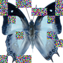

# [*Diffusion Models as Masked Autoencoders (ICCV 2023)*](https://openaccess.thecvf.com/content/ICCV2023/papers/Wei_Diffusion_Models_as_Masked_Autoencoders_ICCV_2023_paper.pdf)


## Installation
```
pip install -r requirements.txt
```

## Dataset (smithsonian_butterflies_subset)
https://huggingface.co/datasets/huggan/smithsonian_butterflies_subset

## Run
```
python main.py
```

## Results
See logs by `tensorboard --logdir checkpoints/{log_name}`.



## Acknowledgement
This code is partially based on [ViT-Pytorch](https://github.com/lucidrains/vit-pytorch)
